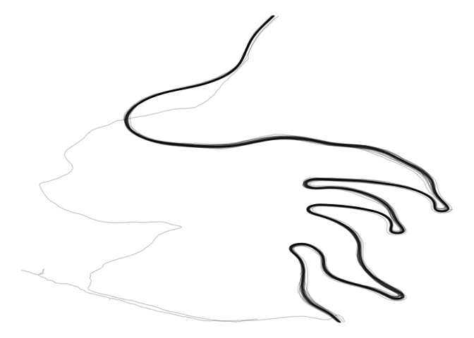
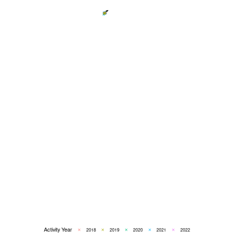

# Idea

Every cyclist has a particular important climb. It might not be a big
deal to anyone else, but any climb can be important!

My favorite local climb goes by the name of ‘Lochen’. It’s located
outside of my local hometown Balingen in the southwest of Germany. It’s
about 4.4 kilometers long with an average gradient of 6.9%.

This doesn’t sound like a hard climb. It might not even register as a
regular big climb for most cyclists. But for me it’s one of the most
iconic climbs.

In the following post, I will let different versions of me race against
each other on my favorite local climb!

In order to reproduce the analysis, perform the following steps:

-   Clone the [repository](https://github.com/duju211/mountain_race)
-   Install the packages listed in the `libraries.R` file
-   Run the target pipeline by executing `targets::tar_make()` command

# Data

The data originates from my personal Strava account. If you have a
Strava account and want to query your data like I do here, you can have
a look at one of my [previous
posts](https://www.datannery.com/posts/strava-data/).

The data are a bunch of arrow files, that you can query via dpylr syntax
thanks to the DuckDB package.

Deselect `heartrate` measurements and restrict the spatial data to a
bounding box. Add information about the type and the start date of each
activity.

    poi <- function(df_act, paths_meas, target_file, act_type,
                    lng_min, lng_max, lat_min, lat_max) {
      act_col_types <- schema(
        moving = boolean(), velocity_smooth = double(),
        grade_smooth = double(), distance = double(),
        altitude = double(), heartrate = int32(), time = int32(),
        lat = double(), lng = double(), cadence = int32(),
        watts = int32(), id = string())

      strava_db <- open_dataset(
        paths_meas, format = "arrow", schema = act_col_types) |>
        to_duckdb()

      df_strava_poi <- strava_db |>
        filter(
          lng >= lng_min, lng <= lng_max, lat >= lat_min, lat <= lat_max) |>
        select(-heartrate) |>
        collect() |>
        left_join(select(df_act, id, type, start_date), by = "id")
    }

    ## # A tibble: 40,439 × 13
    ##    moving velocity_smooth grade_smooth distance altitude  time   lat   lng
    ##    <lgl>            <dbl>        <dbl>    <dbl>    <dbl> <int> <dbl> <dbl>
    ##  1 TRUE               3            3.4   22882.     637.  3925  48.2  8.85
    ##  2 TRUE               3            1.7   22885.     637.  3926  48.2  8.85
    ##  3 TRUE               2.9          3.4   22887.     637   3927  48.2  8.85
    ##  4 TRUE               3            3.4   22890.     637   3928  48.2  8.85
    ##  5 TRUE               2.9          3.3   22893.     637.  3929  48.2  8.85
    ##  6 TRUE               3            3.3   22896.     637.  3930  48.2  8.85
    ##  7 TRUE               2.9          3.3   22899.     637.  3931  48.2  8.85
    ##  8 TRUE               3            5     22902.     637.  3932  48.2  8.85
    ##  9 TRUE               3            4.9   22905.     638.  3933  48.2  8.85
    ## 10 TRUE               3            6.7   22908.     638.  3934  48.2  8.85
    ## # … with 40,429 more rows, and 5 more variables: cadence <int>, watts <int>,
    ## #   id <chr>, type <chr>, start_date <dttm>

Further preprocess the raw data. Keep only rows, where I was moving and
turn the start date from datetime to date. Adjust the `time` column so
that every activity starts at time 0.

    lochen <- function(df_lochen_raw) {
      df_lochen_raw |>
        group_by(id) |>
        mutate(
          time_delta = time - lag(time),
          start_date = as_date(start_date)) |>
        replace_na(list(time_delta = 0)) |>
        filter(moving) |>
        mutate(time = cumsum(time_delta)) |>
        select(-time_delta)
    }

    ## # A tibble: 40,365 × 13
    ## # Groups:   id [36]
    ##    moving velocity_smooth grade_smooth distance altitude  time   lat   lng
    ##    <lgl>            <dbl>        <dbl>    <dbl>    <dbl> <int> <dbl> <dbl>
    ##  1 TRUE               3            3.4   22882.     637.     0  48.2  8.85
    ##  2 TRUE               3            1.7   22885.     637.     1  48.2  8.85
    ##  3 TRUE               2.9          3.4   22887.     637      2  48.2  8.85
    ##  4 TRUE               3            3.4   22890.     637      3  48.2  8.85
    ##  5 TRUE               2.9          3.3   22893.     637.     4  48.2  8.85
    ##  6 TRUE               3            3.3   22896.     637.     5  48.2  8.85
    ##  7 TRUE               2.9          3.3   22899.     637.     6  48.2  8.85
    ##  8 TRUE               3            5     22902.     637.     7  48.2  8.85
    ##  9 TRUE               3            4.9   22905.     638.     8  48.2  8.85
    ## 10 TRUE               3            6.7   22908.     638.     9  48.2  8.85
    ## # … with 40,355 more rows, and 5 more variables: cadence <int>, watts <int>,
    ## #   id <chr>, type <chr>, start_date <date>

# Visualisation

Make a first static ggplot visualisation. Keep the plot rather minimal.
Use `ggplot2::theme_void` as a general theme:

    vis_lochen <- function(df_lochen) {
      df_lochen |>
        ggplot(
          aes(x = lng, y = lat, group = id)) +
        geom_path(alpha = 0.2) +
        theme(
          axis.ticks.x = element_blank(), legend.position = "bottom") +
        labs(x = element_blank(), y = element_blank(), color = "Activity Year")
    }

As you can see there are lot of paths on one road. These are my bike
rides on the ‘Lochen’ pass.

Some paths don’t seem to match. These are activities of another type in
the same region as my bike rides. These activities don’t use the main
road and stand out in the plot.

To further explore the data, make a first animated visualisation with
the `gganimate` package:

    vis_anim_lochen <- function(gg_lochen) {
      gg_lochen +
        transition_reveal(along = time)
    }

In this animated version of the plot, you can see that there are further
problems in the data. Not all bike rides start at the bottom of the
climb. You can guess which activities start at the top of the climb, by
looking at the general speed of the animation. Determine these
activities:

    wrong_direction <- function(df_lochen) {
      df_lochen |>
        group_by(id) |>
        summarise(start_lat = lat[time == min(time)], start_lng = lng[time == min(time)]) |>
        filter(start_lat == min(start_lat))
    }

Filter the activities for bike rides. Exclude activities that start at
the top of the climb. Repeat the above animated plot:

    lochen_ride <- function(df_lochen, df_wrong_direction) {
      df_lochen |>
        filter(type == "Ride") |>
        anti_join(df_wrong_direction, by = "id")
    }

Now it looks much cleaner and the rides are more comparable to one
another.

For the final version of the animation, add small points to point out my
position at the time. Color these positions by the `year` of the
activity Reduce the speed of the animation a little bit, to display
smaller differences in the rides.

    vis_anim_lochen_final <- function(gg_lochen_ride) {
      gg_endpoints <- gg_lochen_ride +
        geom_point(shape = 4, aes(color = as_factor(year(start_date))))
      
      gg_anim_endpoints <- vis_anim_lochen(gg_endpoints)
      
      animate(gg_anim_endpoints, fps = 7)
    }

I very much like how the plot turned out. I hope I can add many more
layers to this animation in the future!
